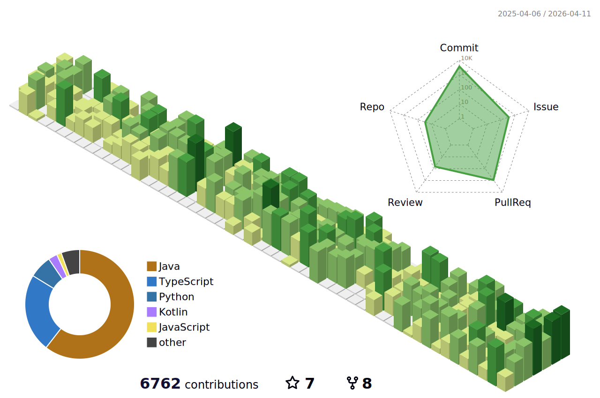

<!-- 헤더 배너 -->

<div align="center">
    <a href="https://git.io/typing-svg"></a>
</div>

<p align="center">
  <!-- 방문자 카운터(옵션) -->
  
  
  
</p>

---

## 👋 About Me

- **Full-stack developer** building **mobile-first apps** with **Ionic/Capacitor**, powered by **Spring Boot** and **Next.js**
- Interested in **scalable backend systems**, **CI/CD automation**, and **clean architecture**
- **Open to collaboration** — feel free to reach out

---

## 🧰 Tech Stack

---

<!-- shields.io 배지 (필요한 것만!!) -->

### 📖 Language


### 🧑‍💻 Backend


### 📚 Frontend


### Database


###  DevOps


---

## 🚀 Recent Projects

<!-- 카드형 핀 (정적 이미지 카드) -->
<table>
  <thead align="center">
    <tr>
      <td><b>🎁 Projects</b></td>
      <td><b>⭐ Stars</b></td>
      <td><b>📚 Commits</b></td>
      <td><b>🛎 Issues</b></td>
      <td><b>📬 Pull requests</b></td>
      <td><b>🧑‍💻 WebSite</b></td>
    </tr>
  </thead>
  <tbody>
    <tr>
      <td><a href="https://github.com/Sejong-Balsamic"><b>Sejong Malsami</b></a></td>
      <td></td>
      <td></td>
      <td></td>
      <td></td>
      <td><a href="https://www.sejong-malsami.co.kr/"><b>WebSite</b></a></td>
    </tr>
	  <tr>
      <td><a href="https://github.com/Team-TicketMate"><b>Ticket Mate</b></a></td>
      <td></td>
      <td></td>
      <td></td>
      <td></td>
      <td><a href="https://www.ticketmate.site"><b>WebSite</b></a></td>
    </tr>
    <tr>
      <td><a href="https://github.com/TEAM-ROMROM"><b>RomRom</b></a></td>
      <td></td>
      <td></td>
      <td></td>
      <td></td>
      <td><a href="https://suh-project.synology.me/romrom/"><b>Download APK</b></a></td>
    </tr>
    <tr>
      <td><a href="https://github.com/Chuseok22/time-mate-web"><b>MeetTime Web</b></a></td>
      <td></td>
      <td></td>
      <td></td>
      <td></td>
      <td><a href="https://meet.chuseok22.com"><b>WebSite</b></a> & <a href="https://play.google.com/store/apps/details?id=com.meettime.app"><b>PlayStore</b></a> </td>
    </tr>
    <tr>
      <td><a href="https://github.com/Chuseok22/time-mate-server"><b>MeetTime Server</b></a></td>
      <td></td>
      <td></td>
      <td></td>
      <td></td>
    </tr>
    <tr>
      <td><a href="https://github.com/CampusTable"><b>CampusTable</b></a></td>
      <td></td>
      <td></td>
      <td></td>
      <td></td>
      <td><a href="https://www.campustable.shop"><b>WebSite</b></a></td>
    </tr>
  </tbody>
</table>

---

## 🚀 Utility Projects

<!-- 카드형 핀 (정적 이미지 카드) -->
<table>
  <thead align="center">
    <tr>
      <td><b>🎁 Projects</b></td>
      <td><b>⭐ Stars</b></td>
      <td><b>📚 Description</b></td>
      <td><b>📈 Marketplace</b></td>
    </tr>
  </thead>
  <tbody>
    <tr>
      <td><a href="https://github.com/Chuseok22/github-issue-helper"><b>GitHub Issue Helper</b></a></td>
      <td></td>
      <td>GitHub 브랜치명 & 커밋 메시지 자동 생성기</td>
      <td><a href="https://github.com/marketplace/actions/chuseok22-issue-helper"><b>Link</b></a></td>
    </tr>
    <tr>
      <td><a href="https://github.com/Chuseok22/version-management"><b>Version Management</b></a></td>
      <td></td>
      <td>프로젝트 자동 버전 관리 워크플로우 (Spring Boot & Next.js)</td>
      <td><a href="https://github.com/marketplace/actions/version-bump-compute-sync-changelog-tag?version=v1.0.0"><b>Link</b></a></td>
    </tr>
    <tr>
      <td><a href="https://github.com/Chuseok22/chuseok22-github-template"><b>GitHub Template</b></a></td>
      <td></td>
      <td>GitHub 프로젝트 템플릿</td>
    </tr>
    <tr>
      <td><a href="https://github.com/Chuseok22/sejong-portal-login"><b>Sejong Uni. Login</b></a></td>
      <td></td>
      <td>세종대학교 포탈 로그인</td>
    </tr>
    <tr>
      <td><a href="https://github.com/Chuseok22/api-change-log"><b>Swagger Api Change Log</b></a></td>
      <td></td>
      <td>Swagger UI API 변경 이력 관리</td>
    </tr>
    <tr>
      <td><a href="https://github.com/Chuseok22/pdf-extractor"><b>PDF Extractor</b></a></td>
      <td></td>
      <td>PDF 내부 데이터를 추출하여 Excel로 저장하는 애플리케이션</td>
    </tr>
    <tr>
      <td><a href="https://github.com/Chuseok22/excel-parser"><b>Excel Parser</b></a></td>
      <td></td>
      <td>Excel 내부 데이터를 분류 후 별도의 엑셀 파일로 추출하는 애플리케이션</td>
    </tr>
  </tbody>
</table>

---

## ⌨️ Coding Status

<!-- (동적) WakaTime 자동 갱신 자리에 삽입될 마커 -->
<!--START_SECTION:waka-->


**🐱 저의 GitHub 정보에요.** 

> 📦 GitHub의 89.7 kB만큼의 저장소를 사용하고 있어요. 
 > 
> 🏆 798 만큼의 Contributions을 2026년에 했어요
 > 
> 🚫 구직중이지 않아요.
 > 
> 📜 31개의 Public Repository를 만들었어요. 
 > 
> 🔑 0개의 Private Repository를 만들었어요. 
 > 
**저는 아침형 인간이에요. 🐤** 

```text
🌞 아침                     92891 commits       ⬛⬛⬛⬛⬛⬛⬛⬛⬛⬛⬜⬜⬜⬜⬜⬜⬜⬜⬜⬜⬜⬜⬜⬜⬜   40.11 % 
🌆 낮　                     120697 commits      ⬛⬛⬛⬛⬛⬛⬛⬛⬛⬛⬛⬛⬛⬜⬜⬜⬜⬜⬜⬜⬜⬜⬜⬜⬜   52.12 % 
🌃 저녁                     12705 commits       ⬛⬜⬜⬜⬜⬜⬜⬜⬜⬜⬜⬜⬜⬜⬜⬜⬜⬜⬜⬜⬜⬜⬜⬜⬜   05.49 % 
🌙 밤　                     5303 commits        ⬛⬜⬜⬜⬜⬜⬜⬜⬜⬜⬜⬜⬜⬜⬜⬜⬜⬜⬜⬜⬜⬜⬜⬜⬜   02.29 % 
```
📅 **제가 가장 생산적인 날은 금요일이에요.** 

```text
월요일                      37730 commits       ⬛⬛⬛⬛⬜⬜⬜⬜⬜⬜⬜⬜⬜⬜⬜⬜⬜⬜⬜⬜⬜⬜⬜⬜⬜   16.29 % 
화요일                      45938 commits       ⬛⬛⬛⬛⬛⬜⬜⬜⬜⬜⬜⬜⬜⬜⬜⬜⬜⬜⬜⬜⬜⬜⬜⬜⬜   19.84 % 
수요일                      47119 commits       ⬛⬛⬛⬛⬛⬜⬜⬜⬜⬜⬜⬜⬜⬜⬜⬜⬜⬜⬜⬜⬜⬜⬜⬜⬜   20.35 % 
목요일                      46068 commits       ⬛⬛⬛⬛⬛⬜⬜⬜⬜⬜⬜⬜⬜⬜⬜⬜⬜⬜⬜⬜⬜⬜⬜⬜⬜   19.89 % 
금요일                      49411 commits       ⬛⬛⬛⬛⬛⬜⬜⬜⬜⬜⬜⬜⬜⬜⬜⬜⬜⬜⬜⬜⬜⬜⬜⬜⬜   21.33 % 
토요일                      3689 commits        ⬜⬜⬜⬜⬜⬜⬜⬜⬜⬜⬜⬜⬜⬜⬜⬜⬜⬜⬜⬜⬜⬜⬜⬜⬜   01.59 % 
일요일                      1641 commits        ⬜⬜⬜⬜⬜⬜⬜⬜⬜⬜⬜⬜⬜⬜⬜⬜⬜⬜⬜⬜⬜⬜⬜⬜⬜   00.71 % 
```


📊 **저는 이번주를 이렇게 시간을 보냈어요.** 

```text
🕑︎ Timezone: Asia/Seoul

💬 프로그래밍 언어들: 
TypeScript               22 hrs 22 mins      ⬛⬛⬛⬛⬛⬛⬛⬛⬛⬛⬛⬛⬛⬛⬛⬛⬜⬜⬜⬜⬜⬜⬜⬜⬜   65.88 % 
Java                     5 hrs 9 mins        ⬛⬛⬛⬛⬜⬜⬜⬜⬜⬜⬜⬜⬜⬜⬜⬜⬜⬜⬜⬜⬜⬜⬜⬜⬜   15.17 % 
CSS                      4 hrs 23 mins       ⬛⬛⬛⬜⬜⬜⬜⬜⬜⬜⬜⬜⬜⬜⬜⬜⬜⬜⬜⬜⬜⬜⬜⬜⬜   12.94 % 
Markdown                 1 hr 22 mins        ⬛⬜⬜⬜⬜⬜⬜⬜⬜⬜⬜⬜⬜⬜⬜⬜⬜⬜⬜⬜⬜⬜⬜⬜⬜   04.04 % 
JSON                     21 mins             ⬜⬜⬜⬜⬜⬜⬜⬜⬜⬜⬜⬜⬜⬜⬜⬜⬜⬜⬜⬜⬜⬜⬜⬜⬜   01.04 % 

🔥 에디터들: 
WebStorm                 26 hrs 18 mins      ⬛⬛⬛⬛⬛⬛⬛⬛⬛⬛⬛⬛⬛⬛⬛⬛⬛⬛⬛⬜⬜⬜⬜⬜⬜   77.43 % 
IntelliJ IDEA            7 hrs 39 mins       ⬛⬛⬛⬛⬛⬛⬜⬜⬜⬜⬜⬜⬜⬜⬜⬜⬜⬜⬜⬜⬜⬜⬜⬜⬜   22.57 % 

🐱‍💻 프로젝트들: 
waitee-app               25 hrs 27 mins      ⬛⬛⬛⬛⬛⬛⬛⬛⬛⬛⬛⬛⬛⬛⬛⬛⬛⬛⬛⬜⬜⬜⬜⬜⬜   74.92 % 
waitee-mock-server       6 hrs 17 mins       ⬛⬛⬛⬛⬛⬜⬜⬜⬜⬜⬜⬜⬜⬜⬜⬜⬜⬜⬜⬜⬜⬜⬜⬜⬜   18.50 % 
rom-back                 52 mins             ⬛⬜⬜⬜⬜⬜⬜⬜⬜⬜⬜⬜⬜⬜⬜⬜⬜⬜⬜⬜⬜⬜⬜⬜⬜   02.56 % 
takitseoul-waitee_app-8f742 mins             ⬛⬜⬜⬜⬜⬜⬜⬜⬜⬜⬜⬜⬜⬜⬜⬜⬜⬜⬜⬜⬜⬜⬜⬜⬜   02.10 % 
chuseok22                29 mins             ⬜⬜⬜⬜⬜⬜⬜⬜⬜⬜⬜⬜⬜⬜⬜⬜⬜⬜⬜⬜⬜⬜⬜⬜⬜   01.43 % 

💻 운영 체제들: 
Mac                      33 hrs 58 mins      ⬛⬛⬛⬛⬛⬛⬛⬛⬛⬛⬛⬛⬛⬛⬛⬛⬛⬛⬛⬛⬛⬛⬛⬛⬛   100.00 % 
```

**저는 주로 Java 언어를 사용해요.** 

```text
Java                     29 repos            ⬛⬛⬛⬛⬛⬛⬛⬛⬛⬛⬛⬛⬛⬜⬜⬜⬜⬜⬜⬜⬜⬜⬜⬜⬜   51.79 % 
Python                   9 repos             ⬛⬛⬛⬛⬜⬜⬜⬜⬜⬜⬜⬜⬜⬜⬜⬜⬜⬜⬜⬜⬜⬜⬜⬜⬜   16.07 % 
TypeScript               9 repos             ⬛⬛⬛⬛⬜⬜⬜⬜⬜⬜⬜⬜⬜⬜⬜⬜⬜⬜⬜⬜⬜⬜⬜⬜⬜   16.07 % 
JavaScript               3 repos             ⬛⬜⬜⬜⬜⬜⬜⬜⬜⬜⬜⬜⬜⬜⬜⬜⬜⬜⬜⬜⬜⬜⬜⬜⬜   05.36 % 
Kotlin                   2 repos             ⬛⬜⬜⬜⬜⬜⬜⬜⬜⬜⬜⬜⬜⬜⬜⬜⬜⬜⬜⬜⬜⬜⬜⬜⬜   03.57 % 
```


 Last Updated on 2026년 02월 16일 03:13:04 UTC UTC
<!--END_SECTION:waka-->

---

## 📊 GitHub Status

<!-- 기본 스탯 카드 -->




|  |  |
|---------------------------------------------------------------------------------------------------------------------------------------------------------------------------------------------------|---------------------------------------------------------------------------------------------------------------------------------------------------------------|
|                                                                                                                                     |                              |

<!-- 커밋 스트릭 -->

<!-- Contribution Graph -->


> *참고: 공개 저장소 기준이며, 모노레포/포크/생성된 파일이 비율에 영향을 줄 수 있습니다.*

